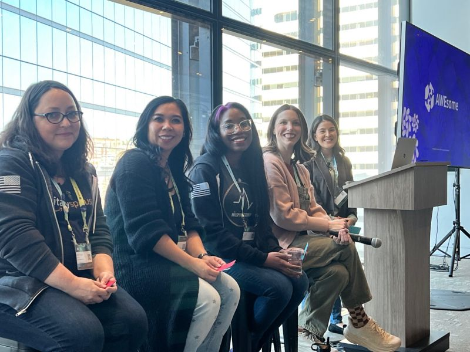
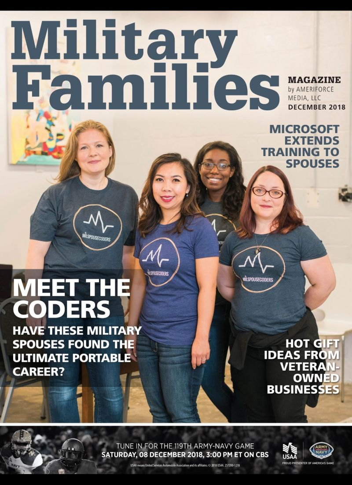
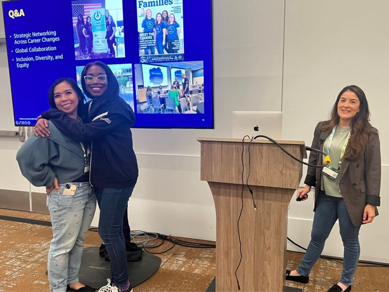

<html> 

<header>
<h1 style="color:White;">
Autumn Nash
</h1>
  

  

</header>

<body style="background-color:Black;">
<h2> About Me </h2>

  

 Former AWS as a Specialist Solutions Architect, focusing on NoSQL databases, before taking the reins of the Greater Seattle area chapter of Milspouse Coders.Im Currently a Language and Runtime Software Developer, where I contributed to open-source projects, built, automated and maintained infrastructure, and completed software releases. I mentor young women through as a Rewriting the Code alumni, and a part of the Black Wing infinity group. 

With a passion for technology and a commitment to empowering Military spouses and women to through technology.  I began my career by teaching military spouses how to code through engaging "Coffee and Code" sessions in Virginia Beach. As the chapter leader, We successfully made Hackathons accessible virtually and in person to help Military Spouses have access from anywhere.  and forged a valuable partnership with Microsoft for our second annual event.

Security is a key passion of mine, and I co-host the podcast "ShipIt" on Changelog, where we dive into the intricacies of infrastructure and DevOps, exploring everything that happens after a Git push. I believe in the power of community and collaboration, and I’m dedicated to making technology accessible to all. I've spoken at conferences like the GraceHopper Celebration, Apache World Part, SheBuilds, AWEsome, the Southern Califronia Linux Expo aka Scale, and Github Universe. I enjoy advocating and helping in my community, I sit on the Board of Directors for the Snohomish County United Way and am on the advocacy board. All thoughts are my own.

   

    
  

    

    
  

  

    
  

  

<a href="here"https://milspousecoders.org/"> Checkout Milspouse Coders </a>

  
</body>
</html>    
